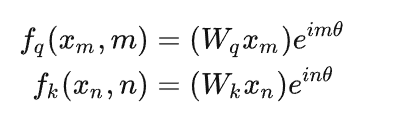

# 从Transformer到Llama

下面这张图是Llama模型的的示意图。从图中看到，Llama模型基本和Transformer是一样的。有几点区别如下：

* Transformer由encoder和decoder构成，而Llama模型只有decoder. 它是Decoder Only结构。所以在Llama模型里面，只有self attention, 没有encoder和decoder之间的cross attention.
* Transformer中采用的是Layer Norm, 而Llama采用的是RMSNorm
* Transformer中的position encoding使用绝对位置编码，而Llama中使用相对位置编码。


本文档的主要参考文档为 [Llama2详解](https://zhuanlan.zhihu.com/p/649756898)

## Normalization

Normalization是已被证明在神经网络中非常有效的做法。在Transformer中，采用的是Layer Norm. 其公式如下。也就是，对输入数值，先将其分布归一化到[-1, 1], 然后再缩放平移。这里的$\gamma$和$\beta$是可以学习的参数。


Llama中采用RMSNorm。RMS是指 Root Mean Square。在[Root Mean Square Layer Normalization](https://arxiv.org/pdf/1910.07467.pdf)这篇论文中提出。其公式如下。


对比二者的公式可知，其主要区别为

* Layer Norm中既有平移，也有缩放。而RMS Norm只有缩放，没有平移
* Layer Norm缩放基于标准差，而 RMS Norm的缩放基于RMS

## Position Encoding

Transformer 中采用的是绝对位置编码，而且位置编码是在进入Transformer block之前做。


其公式如下。偶数位置为正弦函数，技术位置为余弦函数。


Llama 中采用的是相对位置编码，RoPE，而且位置编码是在每次*Q*和*K*相乘之前做的。

（插播：RoPE是中国团队提出的，其在当前的LLM中有重要作用）

RoPE, 最早在[RoFormer: Enhanced Transformer with Rotary Position Embedding](https://arxiv.org/pdf/2104.09864.pdf)这篇论文提出。其目的，是为了通过绝对位置编码的方式实现相对位置编码 （听着就很牛是不是）。所以，RoPE还是绝对位置编码，但是，它可以做到，在*Q*和*K*做內积运算时，会带入二者的相对位置*m-n*. 即满足


或者换句话说，$q_m$和$k_n$的內积受$m-n$影响。

RoPE的编码结果是复数，如下



当embedding dimension为2时，它可以如下表示。


当 $d>2$时，计算方法如下


它可以进一步转化为如下形式。这里的乘法是按位相乘。


到这里我们基本可以读懂代码中RoPE的计算了。


## KV Cache

KV Cache是LLM推理优化中常用的方法。*K*和*V*就是我们前面提到的*Q*, *K*, *V*中的*KV*. 那么，为什么只有KV cache, 而没有Q cache呢？后面揭晓答案

我们知道，Llama模型的decode过程是auto-regressive decoding. 也就是说，每次input一个token, 然后output一个token。类似下图。


这样，我们在decode最新的token时，之前的token的*K*和*V*是计算过的，不需要重新计算。所以可以把它们cache起来，节省计算。

例如，有如下生成任务

```
In  [1]: {prompt:"将进酒："}
Out [1]: 将进酒：人
In  [2]: 将进酒：人
Out [2]: 将进酒：人生
```

当input为"生"时，前面的"将进酒：人"对应的*K*和*V*都已经计算过了。存下来重用就可以。这就是KV Cache.


那么，为什么没有*Q* cache呢？因为每个Q对应的是一个输出的token. 我们会把输出的token 存下来，而inference后面的token时，不需要前面的Q，所以没有*Q* cache.

## 从MHA到MQA / GQA

Transformer中采用的是Multi-Head Attention. Llama中引入了GQA.


如上图所示。MHA中，QKV都会有多个权重矩阵。 Muiti-Query Attention，就是K和V只有一个，但是Query会有多个权重矩阵。但是显然这样会损失模型精度。所以Grouped-Query Attention就是个折中方案，一个KV对应一组Q. KV会比MHA更少，但是多于MQA.