# Transformer

Transformer最早由Google的科学家在2017年提出。参考论文 [Attention Is All You Need](https://arxiv.org/abs/1706.03762)

关于Transformer的解释，这篇文章，[Transformer 超详细解读，一图胜千言](https://zhuanlan.zhihu.com/p/214119876), 有详细解读。这篇文章及其英文原文是本文的主要参考文档。

## 准备工作

我们都知道，神经网络处理的是Vector / Tensor. 那么对于自然语言处理中的字符串，怎样转换成 Tensor 呢？主要有以下步骤
- Tokenization: 字符串切片，每个切片转化为一个id, 叫做token id
- Embedding: token id 转换成one-hot vector, 它和 embedding matrix相乘，得到 embedding

以下为一个例子

__输入数据__：LLM的输入数据是一段文本，可以是一个句子或一段话。文本通常被表示成单词或字符的序列。

> [君不见黄河之水天上来，奔流到海不复回。君不见高堂明镜悲白发，朝如青丝暮成雪。...五花马、千金裘，呼儿将出换美酒，与尔同销万古愁]

__Tokenization__：之后需要将文本进行Tokenization，将其切分成单词或字符，形成Token序列。之后再将文本映射成模型可理解的输入形式，将文本序列转换为整数索引序列(这个索引就是单词或字符在语料库中的index)，这个过程通常由一些开源的文本Tokenzier工具，如sentencepiece等来处理

切片（序列化）
> ['BOS','君','不','见','黄','河','之','水','天','上','来','，' ,'奔','流','到'...'与','尔','同','销','万','古','愁','EOS']

Token Id (语料库索引化)
> ['BOS','10','3','67','89','21','45','55','61','4','324','565' ,'789','6567','786'...'7869','9','3452','563','56','66','77','EOS']

__Embedding__: 文本信息经过Tokenization之后变成了token序列，而Embedding则继续将每个Token映射为一个实数向量，为Embeding Vector

```
'BOS'-> [p_{00},p_{01},p_{02},...,p_{0d-1}] 
'10' -> [p_{10},p_{11},p_{12},...,p_{1d-1}]
'3'  -> [p_{20},p_{21},p_{22},...,p_{2d-1}]
...
'EOS'-> [p_{n0},p_{n1},p_{n2},...,p_{nd-1}]
```


## 概览

最早提出的Transformer是 Encoder-Decoder 结构，由若干encoder和若干decoder构成。现在已经形成了 Encoder-Only, Encoder-Decoder, Decoder-Only 三种不同的结构。我们熟知的Llama系列模型就是Decoder-Only.

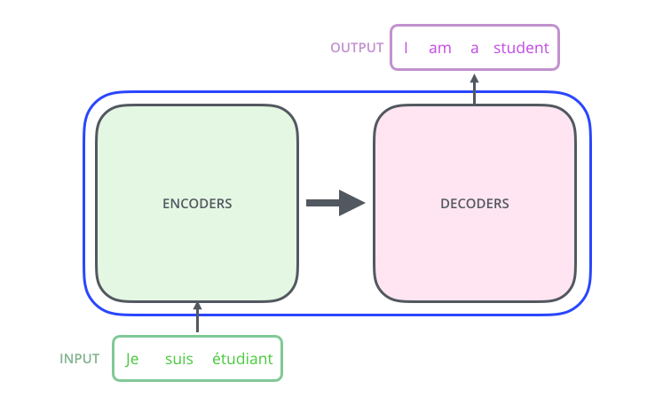

Encoders 和 Decoders 都分别由若干encoder 和 decoder 组成。

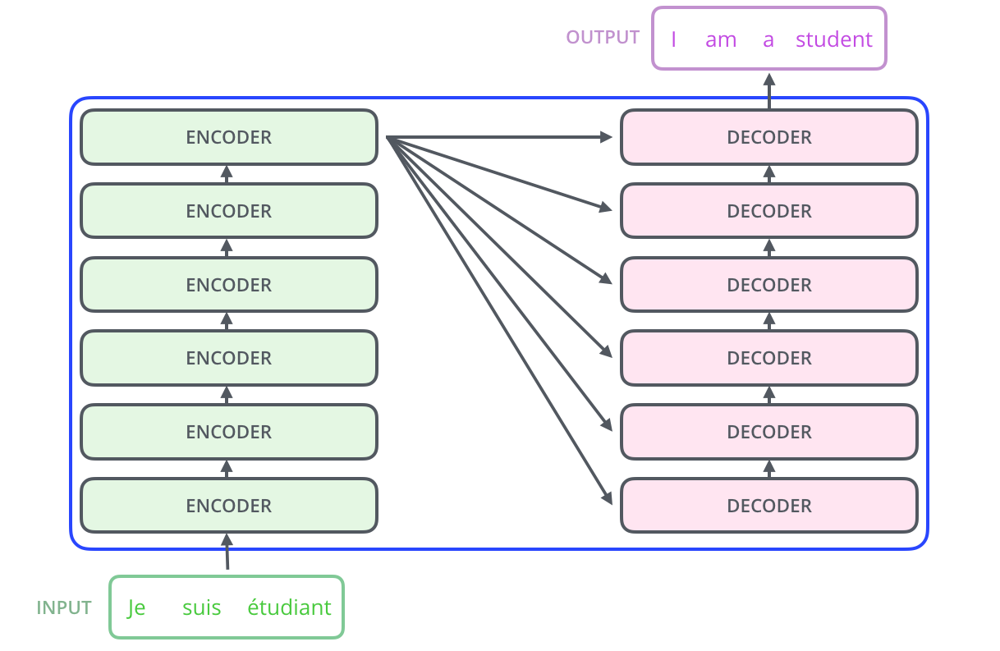

这里需要注意的是，是最后一层 encoder 的 output 和每个 decoder 做 cross attention, 而不是对应层之间。

Encoder 由 Self-Attention 和 Feed Forward Neural Network 组成。
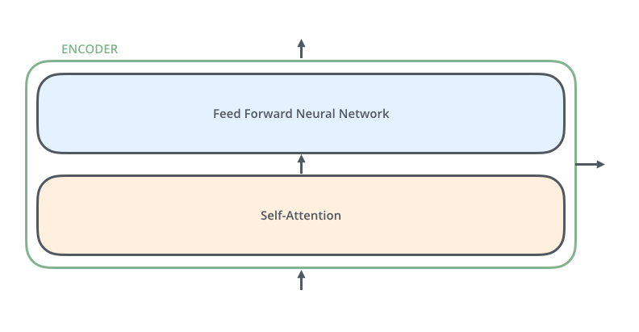

Decoder 稍复杂一些，除了Self-Attention, 还有 Encoder-Decoder Attention (Cross Attention)

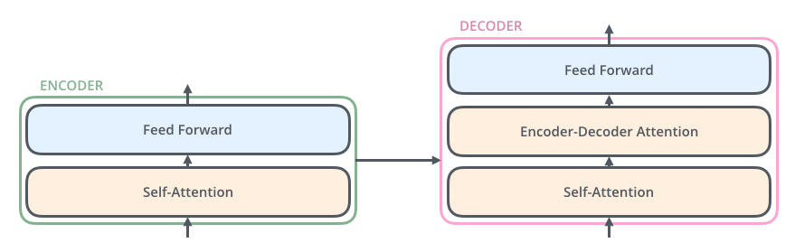

更详细的结构图如下。Encoder这边，embedding先做position encoding, 然后是 Attention, Layer Norm, 最后 Feed Forward, 也就是一个MLP。Decoder 这边也类似。只是在Self-Attention之后会和Encoder 的输出再做一次 Attention

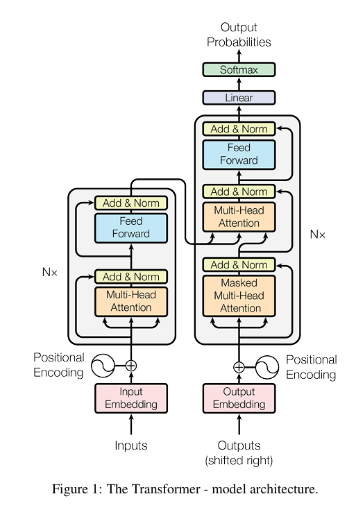

## Self-Attention

Self-Attentiond的基本定义如下。

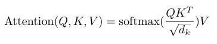

接下来我们举例来看。假定输入 *X* 有两个token. *X* 分别与*Q*, *K*, *V* 的权重矩阵相乘后，得到 *Q*, *K*, *V*.

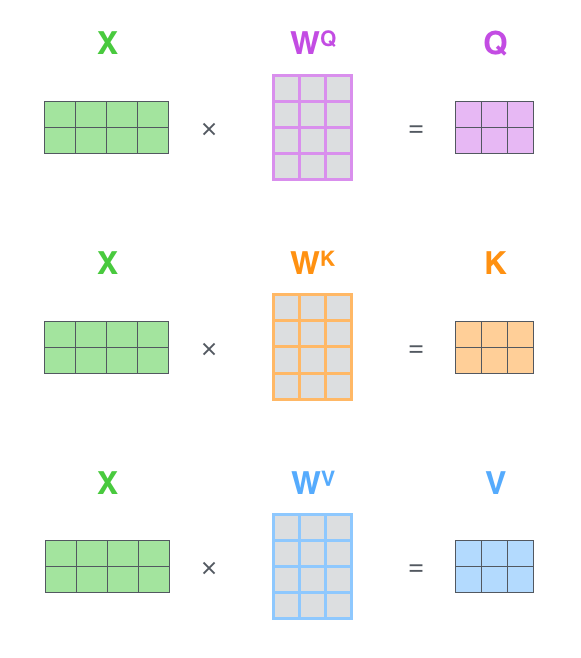

接下来就可以计算Attention了。

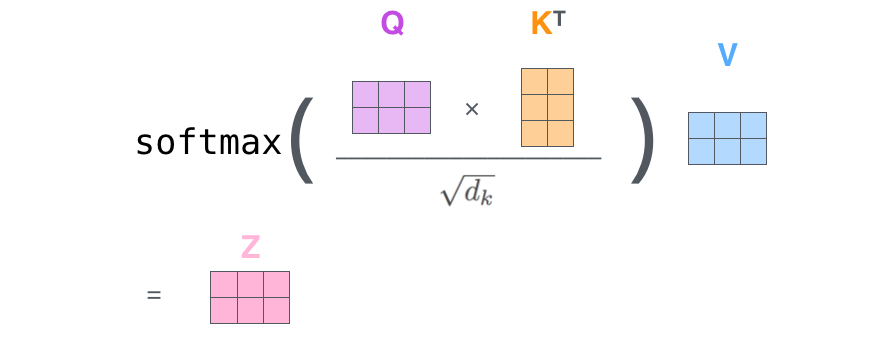

接下来我们再把这个过程拆解一下。

第一步，从输入到 *Q*, *K*, *V*

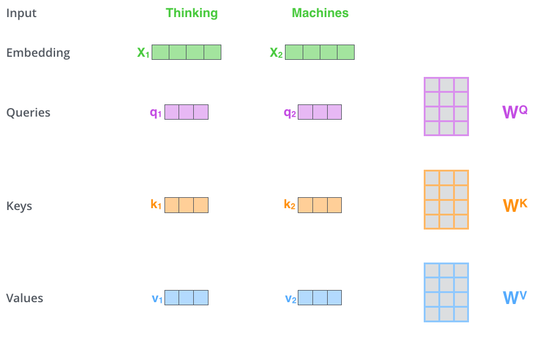

第二步，计算相关性 Score, 也就是 Attention Score. "Thinking" 和自己的 Attention Score 是 112， 和 "Machines" 的Attention Score是96.

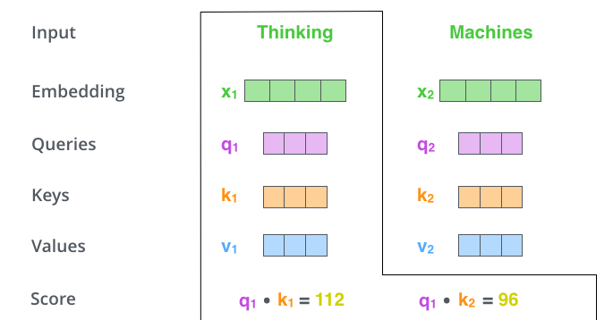

第三步，归一化以及计算Softmax. 除以8是因为 *q*, *k*, *v*的维度是64

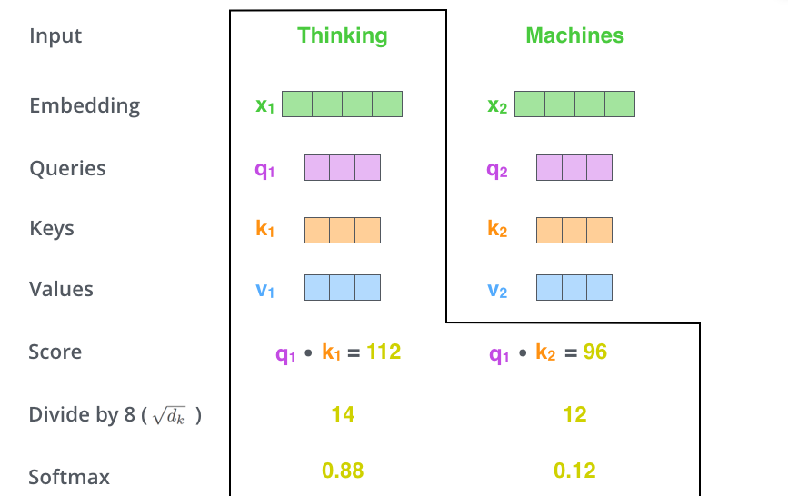

第四步，计算Z. $z_1 = 0.88 \times v_1 + 0.12 \times v_2$. 也就是说，最终的结果是以Attention Score 为权重，对V进行加权平均而得。到这里，就完成的 Self Attention的计算。

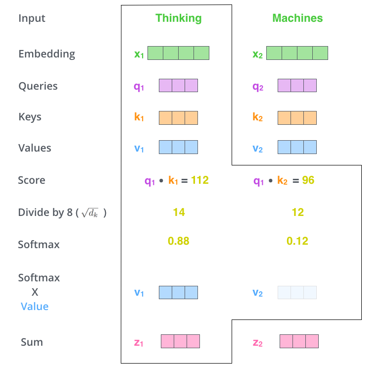


## Multi-Head Attention

多头注意力的引入原理不做探讨。这里我们从解码的角度看它是怎么做的。

整体上来看，多头注意力就是计算多个Self Attention，每个Self Attention都有各自的权重矩阵, 然后拼接起来，最后和一个权重矩阵相乘，即可。

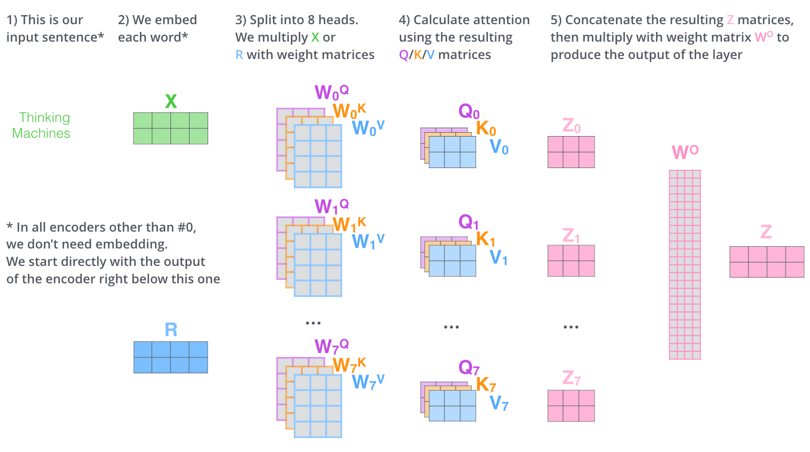

分解来看。首先，分别计算 *Q*, *K*, *V*

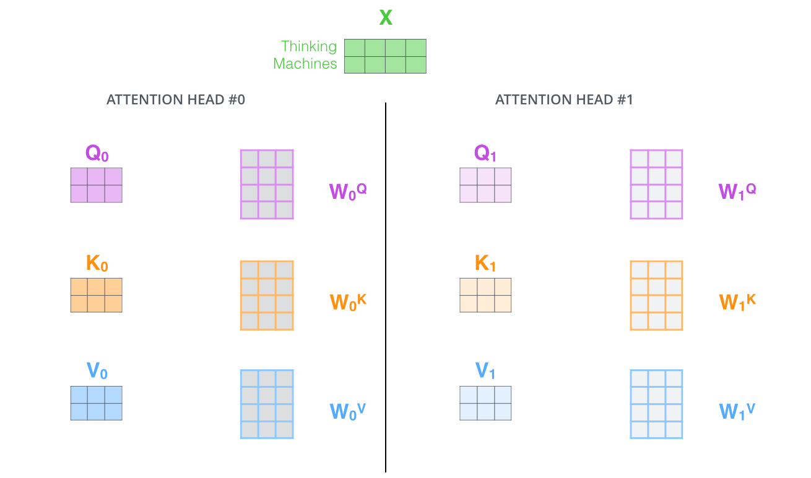

然后分别计算 Self Attention *Z*

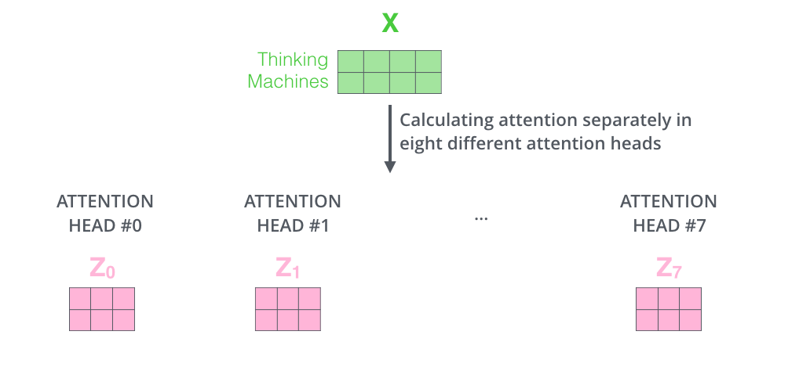

最后，汇合多个 Self Attention 为最终的 Multi-Head Attention. 拼接各个 Self Attention $Z_i$, 然后结果乘以权重矩阵。所以，多个头的Attention的汇合也是学习得到。

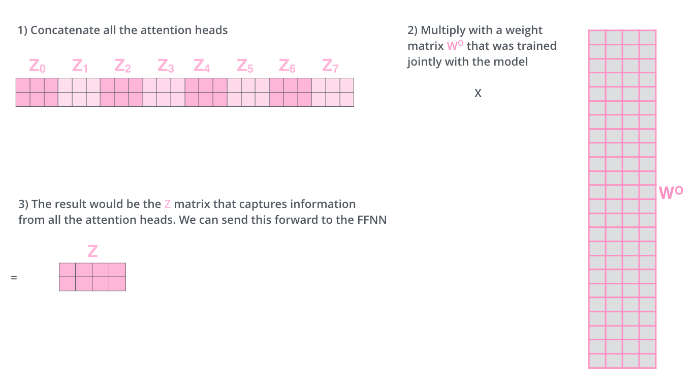

## 最后的输出层

从解码的过程来看，经过若干decoder之后，在得到最后的输出之前，还要经过Linear层以及Softmax层。Linear层的输出维度为词表长度，经过softmax之后的结果就可以得到概率最大的词。

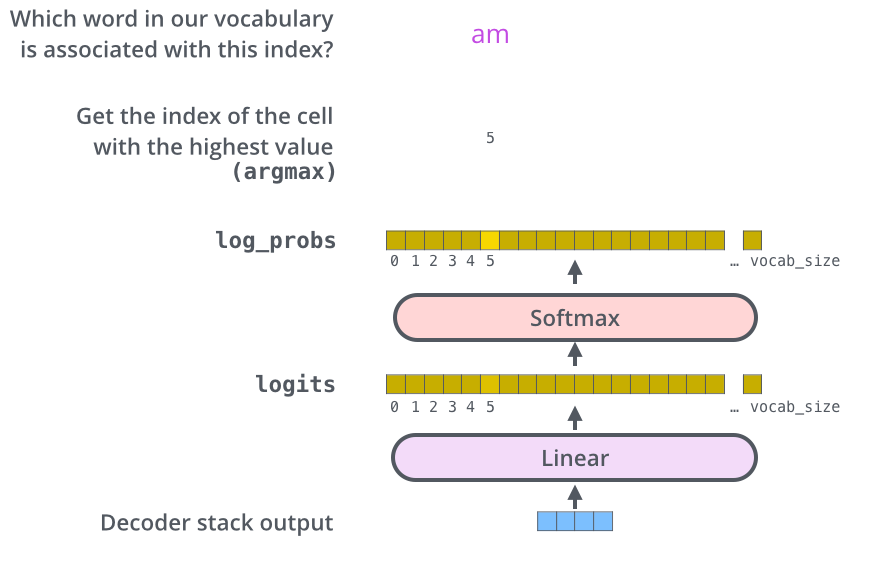

关于Transformer的介绍先到这里。Transformer的decoding以及position embedding的计算和我们关注的llama略有区别，这里不做介绍。