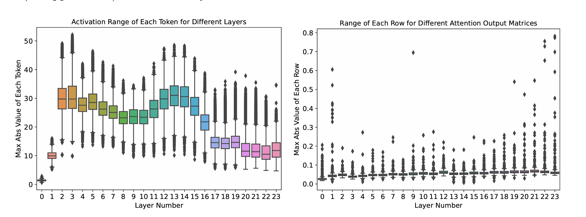

# Quantization Basics
## What is quantization
map the real value to quantized int8 values, to get computing efficiency improvement on supported hardware.

1. int8 [-128, 127]
2. uint8 [0, 255]

### How to do the map?
we have below candidate quantization paradigms

> - Paradigm 1.  `real_value = A * quantized_value + B`
> - Paradigm 2. `real_value = C * (quantized_value + D)`

<b>Domain-specific constraints for DL: `0` must be exactly reprenstable! </b>

- For example, zero padding/masking handling, if `0` not representable in int8, it will cause inaccuracy/bias.
- we call this quantized uint8 value of real_value `0` as `zero_point`
        
<b>Paradigm 2 is the choice </b>
- `real_value = scale * (quantized_value - zero_point)`
- `quantized_value = round(scale * real_value + zero_point)` (the scale is different with the above line, let's just call it scale)

### How to apply this paradigm?
- Asymmetric mode (Affine quantization mode)
    - targeting int8, $Scale = (|max(x_f) - min (x_f)|)/127$, $ZeroPoint = -128 - min(x_f)/Scale$
    - targeting uint8, $Scale = (|max(x_f) - min (x_f)|)/255$, $ZeroPoint = - min(x_f)/Scale$
    -
    - 

- Symmetric mode (scale quantization mode)
    - targeting int8, $Scale = max(|x_f|)/127$, $ZeroPoint = 0$
    - targeting uint8, $Scale = max(|x_f|)/255$, $ZeroPoint = 128$
    - 

### One more question:  how to handle outliers?
- Common clipping/saturation strategies
    - MinMax
    - Percentile
    - Entropy
    - ...

## How to quantize a model?

Let's take onnxruntime quantization as an example. [onnxruntime-inference-examples/tree/main/quantization](https://github.com/microsoft/onnxruntime-inference-examples/tree/main/quantization)

### Post training quantization
1. Calibrate with a dataset to get tensor quantization parameter
    1. Graph augmentation: mark all `op_quant_candidates` as output nodes
    2. collect tensor range(min max value, histogram) through the calibration dataset
        - 
    3. determine the tensor quantization parameter by the clipping strategy
        - Entropy calibration [s7310-8-bit-inference-with-tensorrt.pdf (gputechconf.com)](https://on-demand.gputechconf.com/gtc/2017/presentation/s7310-8-bit-inference-with-tensorrt.pdf)
            - Key idea: minimize the loss of information when quantize the distribution to int8.
            - How: use Kullback-Leibler divergence to measure the loss, choose the clipping threshold with minimal loss
            - 
            - 
2. Quant the model with the tensor quantization parameter
    Let's see a simple model (all the onnx model are in quantized_models folder.
    - model structure
        -   ```
                (input)
                / \
                /   \
            Conv1    \
                |      \
            Relu   Conv3
                |      |
            Conv2      |
                \      /
                Add
                    |
                output
            ```
    - Original model:
        - 
    - Quantized model (QO format)
        - 
    - Quantized model (QDQ format)
        - 
- code pointer: [onnxruntime/onnxruntime/python/tools/quantization/quantize.py at main · microsoft/onnxruntime (github.com)](https://github.com/microsoft/onnxruntime/blob/main/onnxruntime/python/tools/quantization/quantize.py#L255)

### Quantization granularity
- On which granularity we choose the tensor quantization parameters
    - Per Layer
    - Per Tensor
    - Per Channel
    - Per Token
    - ...
- An example: `QuantLinear` of ONNX
    - `QuantizeLinear` was designed to support per tensor and per layer quantization.
    - 
    - ```
        node = onnx.helper.make_node(
            "QuantizeLinear",
            inputs=["x", "y_scale", "y_zero_point"],
            outputs=["y"],
        )
        
        x = np.array(
            [
                [
                    [[-162, 10], [-100, 232], [-20, -50]],
                    [[-76, 0], [0, 252], [32, -44]],
                    [[245, -485], [-960, -270], [-375, -470]],
                ],
            ],
            dtype=np.float32,
        )
        y_scale = np.array([2, 4, 5], dtype=np.float32)
        y_zero_point = np.array([84, 24, 196], dtype=np.uint8)
        y = (x / y_scale.reshape(1, 3, 1, 1) + y_zero_point.reshape(1, 3, 1, 1)).astype(
            np.uint8
        )
        
        expect(
            node,
            inputs=[x, y_scale, y_zero_point],
            outputs=[y],
            name="test_quantizelinear_axis",
        )
        ```
### Dynamic quantization
- Dynamic quantized model
    - 
- `DynamicQuantizedLinear`
    - 
    - ```
        node = onnx.helper.make_node(
            "DynamicQuantizeLinear",
            inputs=["x"],
            outputs=["y", "y_scale", "y_zero_point"],
        )

        # expected scale 0.0196078438 and zero point 153
        X = np.array([0, 2, -3, -2.5, 1.34, 0.5]).astype(np.float32)
        x_min = np.minimum(0, np.min(X))
        x_max = np.maximum(0, np.max(X))
        Y_Scale = np.float32((x_max - x_min) / (255 - 0))  # uint8 -> [0, 255]
        Y_ZeroPoint = np.clip(round((0 - x_min) / Y_Scale), 0, 255).astype(np.uint8)
        Y = np.clip(np.round(X / Y_Scale) + Y_ZeroPoint, 0, 255).astype(np.uint8)

        expect(
            node,
            inputs=[X],
            outputs=[Y, Y_Scale, Y_ZeroPoint],
            name="test_dynamicquantizelinear",
        )
        ```

### Quantization aware training
- To preserve accuracy, let's make quantization trainable!
- Make `Quant/Dequant` differentiable for back propagation!
    - do float to float `fake` quantize and dequantize
    - observe the fake quantize parameters through the QAT dataset
- How?
    -  `Linear` to `QAwareLinear`
        - 
    - What does the qconfig looks like: (from torch.ao.quantization library)
        - 

### An advanced example - Quantization in [FasterTransformer](https://github.com/NVIDIA/FasterTransformer/blob/df4a7534860137e060e18d2ebf019906120ea204/docs/bert_guide.md)

- Follow chat of encoder

- INT8 quantization mode 1 & 2 for BERT


# LLM Quantization

## ZeroQuant

A pioneering work on billion-scale generative model quantization.(DeepSpeed)

### The challenges:
1. Dynamic activation range
2. Different ranges of neurons in weight matrices


### Solution
- Fine-grained Quantization Scheme
    - Group-wise quantization for weights
        - A weight matrix is partitioned to g groups, and each group is quantized seperately
    - Token-wise quantization for activations
        - Dynamically calculate the min/max range for each token to reduce the quantization error from activations
    - Implementations
        - Group-wise quantization in `SymQuantizer`
            - 
        - Token-wise activation for activations (Configuration in `LinearLayer_Compress`)
            - 
        
    
- Layer-by-Layer knowledge distillation(LKD)

LKD quantizes the network layer-by-layer and uses its original (i.e., unquantized) version as the teacher model. Assume $L_k$ is the layer to quantize, and $\widehat{L_k}$ is the quantized version, use the output of the $L_{k-1}$ (i.e., by running inference on X over the first k 1 layers) as the input of $L_k$ and $\widehat{L_k}$, measure the difference, and do the model update to $L_k$.


- Kernels
    - CUTLASS INT8 GEMM
    - Fusing token-wise activation quantization


## LLM.int8()

The author of `bitsandbytes` is one of the paper authors.

### Key finding: Activations of LLM are difficult to quantize

 When we scale up LLMs beyond 6.7B parameters, systematic outliers with large magnitude will emerge in activations, leading
 to large quantization errors and accuracy degradation。
 1. At the 6.7B scale, 150,000 outliers occur per sequence, but they are concentrated in only 6 feature dimensions across the entire transformer
 2. Set the dimension to 0, great decrease the perplexity (600 ~ 1000%), but random set some dimension to 0 has small impact on perplexity (0.3%).


### How to handle the extreme outliers?


#### Vector-wise Quantization

view matrix multiplication as a sequence of indepedent inner products, to increase the number of quantization parameters.


#### Mix-precision decomposition

decompose the feature and weights into sub-matrices of large magnitude features(~0.1%) and other values. Caculate in different precision and merge them to fp16 outputs.


## GPTQ
An one-shot weight quantization method based on approximate second-order information. Recommend reading: [GPTQ&OBQ：量化你的GPT](https://readpaper.feishu.cn/docx/OPP2dTuXAoaO0oxWhQAcC05Wnpc)

### Layer-wise quantization


### Quntization method
 1. Optimial Brain Damage (1989) - introduce Hessian matrix
 2. Optimal Brain Surgeon (1993) - introduce weight pruning compensation
 3. Optimal Brain Quantization (2022) - Use it in quantizaiton and add greedy strategy
 4. GPTQ (2023)
    - Order doesn't matter
    - Lazy Batch-Updates
    - Cholesky reformulation


## AWQ (Activation-aware training)

### Observation: weights are not equally important; 0.1% salient weights


### Observation: salient weights are determined by activation distribution, not weight 


### Solution: protect salient weights by scaling
 

## Smooth Quant
### Solution
 - Migrate the quantization difficulty from activation to weights!
    - with a mathematically equivalent transformation.

    
    

### Smooth Quant in TensorRT-LLM
Code Pointer: [hf_llama_convert](https://github.com/NVIDIA/TensorRT-LLM/blob/a21e2f85178111fed9812bb88c2cc7411b25f0ba/examples/llama/hf_llama_convert.py#L58)

- `smooth_llama_model`
    - Attention part 
        - Smooth `q_proj`, `k_proj` and `v_proj`
            - Scale on activation fused with `input_layernorm`
        - Smooth `o_proj`
        -  `LlamaDecodeLayer` be like
        
    - FFN part
        - Smooth `fc1_gate`
            - Scale both `gate_proj` and `up_proj`
            - Scale on activation fused with `post_attention_layernorm`   
        - Smooth `down_proj`
        - `LlamaMLP` be like
        
- `smooth_gemm` function

- Related plugin configuration


# Recommend readings:
- [gemmlowp/doc/quantization.md at master · google/gemmlowp (github.com)](https://github.com/google/gemmlowp/blob/master/doc/quantization.md#how-this-differs-from-the-older-legacy-gemmlowp-quantization-paradigm)
- [Quantization - Neural Network Distiller (intellabs.github.io)](https://intellabs.github.io/distiller/algo_quantization.html)
- [neural-compressor/docs/source/quantization.md at master · intel/neural-compressor (github.com)](https://github.com/intel/neural-compressor/blob/master/docs/source/quantization.md)
- [ZeroQuant](https://arxiv.org/pdf/2206.01861.pdf)
- [LLM.int8()](https://proceedings.neurips.cc/paper_files/paper/2022/file/c3ba4962c05c49636d4c6206a97e9c8a-Paper-Conference.pdf)
- [GPT-Q](https://arxiv.org/pdf/2210.17323.pdf)
- [AWQ](https://www.dropbox.com/scl/fi/dtnp6h6y1mnp7g036axu6/AWQ-slide.pdf?rlkey=ffgh50hxhx8dmsnjiu8kef0ou&dl=0)
- [Smooth Quant](https://github.com/mit-han-lab/smoothquant/blob/main/assets/SmoothQuant.pdf)